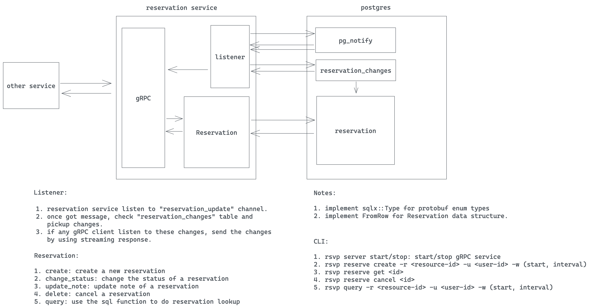

# Core Reservation
- Feature Name: `core reservation`
- Start Date: 2025-06-03 16:57:15

## Summary

A core reservation service that solves the problem of reserving a resource for a specific period of time. We leverage postgres EXCLUDE constraints to ensure the only one reservation can be made for a given resource at a given time.

## Motivation

We need a common solution for various reservation problems, such as booking a room, reserving a car, or scheduling an appointment. Repeatedly implementing this logic in different parts of the codebase leads to code duplication, bugs, and maintenance challenges. We should have a single, reusable solution that can be used across the codebase.

## Guide-level explanation

Basic architecture:


### Service interface

We would use gRPC as a service interface. Below is the basic proto file for the service:

```proto
import "google/protobuf/timestamp.proto";

enum ReservationStatus {
   RESERVATION_STATUS_UNKNOWN = 0;
   RESERVATION_STATUS_PENDING = 1;
   RESERVATION_STATUS_CONFIRMED = 2;
   RESERVATION_STATUS_BLOCKED = 3;
}

enum ReservationUpdateType {
    RESERVATION_UPDATE_TYPE_UNKNOWN = 0;
    RESERVATION_UPDATE_TYPE_CREATE = 1;
    RESERVATION_UPDATE_TYPE_UPDATE = 2;
    RESERVATION_UPDATE_TYPE_DELETE = 3;
}

message Reservation {
    string id = 1;
    string user_id = 2;
    ReservationStatus status = 3;

    // resource reservation window
    string resource_id = 4;
    google.protobuf.Timestamp start = 5;
    google.protobuf.Timestamp end = 6;

    // extra
    string note = 7;
}

message ReserveRequest {
    Reservation reservation = 1;
}

message ReserveResponse {
    Reservation reservation = 1;
}

message UpdateRequest {
    string note = 1;
}

message UpdateResponse {
    Reservation reservation = 1;
}

message ConfirmRequest {
    string id = 1;
}

message ConfirmResponse {
    Reservation reservation = 1;
}

message CancelRequest {
    string id = 1;
}

message CancelResponse {
    Reservation reservation = 1;
}

message GetRequest {
    string id = 1;
}

message GetResponse {
    Reservation reservation = 1;
}

message QueryRequest {
    string resource_id = 1;
    string user_id = 2;
    // use status to filter results. If UNSPECIFIED, return all reservations.
    ReservationStatus status = 3;
    google.protobuf.Timestamp start = 4;
    google.protobuf.Timestamp end = 5;
}

message WatchRequest {}

message WatchResponse {
    ReservationUpdateType op = 1;
    Reservation reservation = 2;
}

service ReservationService {
    rpc reserve(ReserveRequest) returns (ReserveResponse);
    rpc update(UpdateRequest) returns (UpdateResponse);
    rpc confirm(ConfirmRequest) returns (ConfirmResponse);
    rpc cancel(CancelRequest) returns (CancelResponse);
    rpc get(GetRequest) returns (GetResponse);
    rpc query(QueryRequest) returns (stream Reservation);
    // another system could watch newly created/confirmed/cancelled reservation.
    rpc watch(WatchRequest) returns (WatchResponse);
}

```


## Database schema

We use postgres as our database. Below is the basic schema for the reservation service:

```sql
CREATE SCHEMA rsvp;
CREATE TYPE rsvp.reservation_status AS ENUM (
    'UNSPECIFIED',
    'PENDING',
    'CONFIRMED',
    'BLOCKED'
);

CREATE TABLE rsvp.reservations (
    id uuid NOT NULL DEFAULT uuid_generate_v4(),
    user_id VARCHAR(64) NOT NULL,
    status rsvp.reservation_status NOT NULL DEFAULT 'PENDING',

    resource_id VARCHAR(64) NOT NULL,
    timespan tstzrange NOT NULL,

    note TEXT,

    -- Ensure that no two reservations overlap for the same resource
    CONSTRAINT reservations_pkey PRIMARY KEY (id),
    CONSTRAINT reservations_resource_exclusion
        EXCLUDE USING GIST (resource_id WITH =, timespan WITH &&)
);
CREATE INDEX reservations_user_id_idx ON rsvp.reservations (user_id);
CREATE INDEX reservations_resource_id_idx ON rsvp.reservations (resource_id);

-- If user_id id null, find all reservations for the resource in the given time range.
-- If reservation_id is null, find all reservations for the user in the given time range.
-- If both are null, find all reservations in the given time range.
CREATE OR REPLACE FUNCTION rsvp.query(uid text, rid text, during tstzrange) RETURNS TABLE rsvp.reservations as $$ $$ LANGUAGE plpgsql;

```

We also need a table to track reservation changes, so that we can notify other systems when a reservation is created, updated, or deleted. This is useful for systems that need to react to reservation changes, such as sending notifications or updating user interfaces.

```sql
CREATE TYPE rsvp.reservation_update_type as ENUM (
    'UNKNOWN',
    'CREATE',
    'UPDATE',
    'DELETE',
)
-- reservatuib change table
CREATE TABLE rsvp.reservations_changes (
    id SERIAL NOT NULL,
    reservation_id uuid NOT NULL,
    op revp.reservation_update_type NOT NULL,
)

-- trigger for create/updarte/delete a reservation.
CREATE OR REPLACE FUNCTION rsvp.reservation_trigger() RETURNS trigger AS
$$
BEGIN
    IF TG_OP = 'INSERT' THEN
        -- update reservations_changes
        INSERT INTO rsvp.reservations_changes (reservation_id, op) VALUES (NEW.id, 'CREATE');
    ELSIF TG_OP = 'UPDATE' THEN
        -- if status changed, update reservations_changes
        IF OLD.status <> NEW.status THEN
            INSERT INTO rsvp.reservations_changes (reservation_id, op) VALUES (NEW.id, 'UPDATE');
        END IF;
    ELSIF TG_OP = 'DELETE' THEN
        -- update reservations_changes
        INSERT INTO rsvp.reservations_changes (reservation_id, op) VALUES (OLD.id, 'DELETE');
    END IF;
    -- notify the reservation change
    NOTIFY reservation_update;
    RETURN NULL;
END;
$$ LANGUAGE plpgsql;

CREATE TRIGGER reservation_trigger
    AFTER INSERT OR UPDATE OR DELETE ON rsvp.reservations
    FOR EACH ROW EXECUTE FUNCTION rsvp.reservation_trigger();
```

## Code flow



## Reference-level explanation

N/A

## Drawbacks

N/A

## Rationale and alternatives

N/A

## Prior art

N/A

## Unresolved questions

- how to handle repeated reservation?
- if load is big, we may need an external queue for recording changes.
- query performance may be an issue - need to use indexes or add cache.

## Future possibilities

Think about what the natural extension and evolution of your proposal would
be and how it would affect the language and project as a whole in a holistic
way. Try to use this section as a tool to more fully consider all possible
interactions with the project and language in your proposal.
Also consider how this all fits into the roadmap for the project
and of the relevant sub-team.

This is also a good place to "dump ideas", if they are out of scope for the
RFC you are writing but otherwise related.

If you have tried and cannot think of any future possibilities,
you may simply state that you cannot think of anything.

Note that having something written down in the future-possibilities section
is not a reason to accept the current or a future RFC; such notes should be
in the section on motivation or rationale in this or subsequent RFCs.
The section merely provides additional information.
